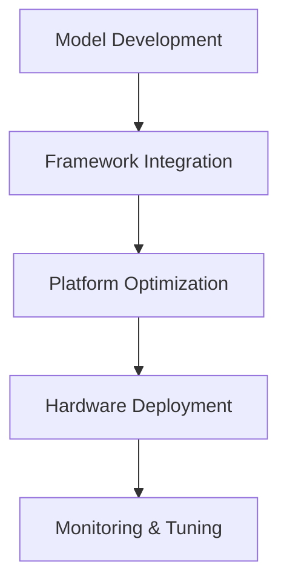

# AI Accelerator Software Ecosystem Analysis

## Development Frameworks

### Primary SDKs
| Platform | SDK Name | Language Support | Key Features | Maturity |
|----------|----------|------------------|--------------|-----------|
| NVIDIA | CUDA | C++, Python, Fortran | Comprehensive, Full Stack | Mature |
| Google TPU | JAX, XLA | Python, C++ | ML Focused, Cloud Native | Advanced |
| Intel Gaudi | oneAPI | C++, Python, SYCL | Cross-Architecture | Growing |
| Cerebras | CS Stack | Python | Wafer-Scale Optimized | Specialized |
| AWS Trainium | Neuron | Python | Cloud Integration | Developing |
| Apple Baltra | Core ML | Swift, Python | Apple Ecosystem | Emerging |
| Lightmatter | Envise | Python | Photonic Optimized | Early |
| IBM Analog | Analog AI | Python | Research Focused | Research |

### Framework Support

1. **Universal Support**
   - PyTorch
   - TensorFlow
   - ONNX
   - MXNet

2. **Platform-Specific**
   - NVIDIA: TensorRT, cuDNN
   - Google: JAX, TensorFlow
   - Intel: oneDNN, OpenVINO
   - AWS: SageMaker
   - Apple: Core ML Tools

## Development Tools

### Compilers and Optimizers
1. **Traditional Approaches**
   ```
   Model → IR → Platform Optimization → Hardware
   ```
   - NVIDIA: NVCC, CUDA Compiler
   - Intel: DPC++, oneAPI Compiler
   - Google: XLA Compiler
   - AWS: Neuron Compiler

2. **Novel Architectures**
   ```
   Model → Custom IR → Architecture-Specific Transforms → Hardware
   ```
   - Cerebras: CS Compiler
   - Lightmatter: Photonic Compiler
   - Quantum: Quantum-Classical Compiler
   - Analog: Analog Transform Engine

### Development Tools

#### Profiling and Debugging
| Platform | Profiler | Debugger | Analysis Tools |
|----------|----------|----------|----------------|
| NVIDIA | NSight | CUDA-GDB | Visual Profiler |
| Google TPU | Cloud Profiler | XLA Debug | TPU Analyzer |
| Intel | VTune | GDB | oneAPI Tools |
| Cerebras | CS Tools | CS Debug | Performance Analyzer |
| AWS | CloudWatch | Neuron Debug | SageMaker Tools |

#### Optimization Tools
1. **Performance Optimization**
   - Model optimization
   - Memory usage
   - Throughput analysis
   - Power efficiency

2. **Model Conversion**
   - Framework conversion
   - Quantization tools
   - Precision adaptation
   - Architecture-specific optimization

## Software Stack Integration

### System Integration
```
Application Layer
    ↓
Framework Layer
    ↓
Platform SDK
    ↓
Hardware Abstraction
    ↓
Hardware Layer
```

### Deployment Models
1. **Cloud Native**
   - Containerization
   - Orchestration
   - Scaling tools
   - Monitoring

2. **On-Premise**
   - Installation tools
   - Management software
   - Monitoring systems
   - Update mechanisms

3. **Edge Deployment**
   - Embedded tools
   - Remote management
   - Update systems
   - Monitoring

## Programming Models

### Abstraction Levels
1. **High-Level**
   - Framework APIs
   - Model definitions
   - Training scripts
   - Deployment tools

2. **Mid-Level**
   - Platform SDKs
   - Custom operators
   - Optimization tools
   - Performance tuning

3. **Low-Level**
   - Hardware access
   - Custom kernels
   - Direct programming
   - Assembly optimization

### Development Workflow


## Ecosystem Challenges

### Integration Issues
1. **Cross-Platform**
   - Framework compatibility
   - Model portability
   - Performance consistency
   - Tool integration

2. **Version Management**
   - SDK updates
   - Framework compatibility
   - Hardware support
   - Tool chain maintenance

### Development Barriers
1. **Technical Challenges**
   - Learning curve
   - Documentation quality
   - Tool complexity
   - Debug difficulty

2. **Resource Requirements**
   - Development time
   - Expertise needs
   - Hardware access
   - Training resources

## Best Practices

### Development Guidelines
1. **Code Organization**
   - Modular design
   - Platform abstraction
   - Clear interfaces
   - Documentation

2. **Performance Optimization**
   - Profiling-driven
   - Memory-aware
   - Power-conscious
   - Scalability-focused

### Testing Strategies
1. **Validation Approaches**
   - Unit testing
   - Integration testing
   - Performance testing
   - Deployment testing

2. **Quality Assurance**
   - Automated testing
   - Continuous integration
   - Performance benchmarking
   - Compatibility testing

## Future Trends

### Ecosystem Evolution
1. **Unification Efforts**
   - Common standards
   - Shared tools
   - Universal APIs
   - Cross-platform support

2. **Tool Innovation**
   - AI-assisted development
   - Automated optimization
   - Advanced debugging
   - Intelligent profiling

## Recommendations

### For Developers
- Start with high-level APIs
- Use platform-specific optimizations
- Implement proper testing
- Monitor performance

### For Organizations
- Standardize development
- Invest in training
- Build expertise
- Plan for scaling

## References

1. [NVIDIA Developer](https://developer.nvidia.com/)
2. [Intel oneAPI](https://software.intel.com/oneapi)
3. [Google Cloud TPU](https://cloud.google.com/tpu)
4. [AWS Neuron](https://aws.amazon.com/machine-learning/neuron/)

[Note: Documentation and tool availability may vary by platform and version]
